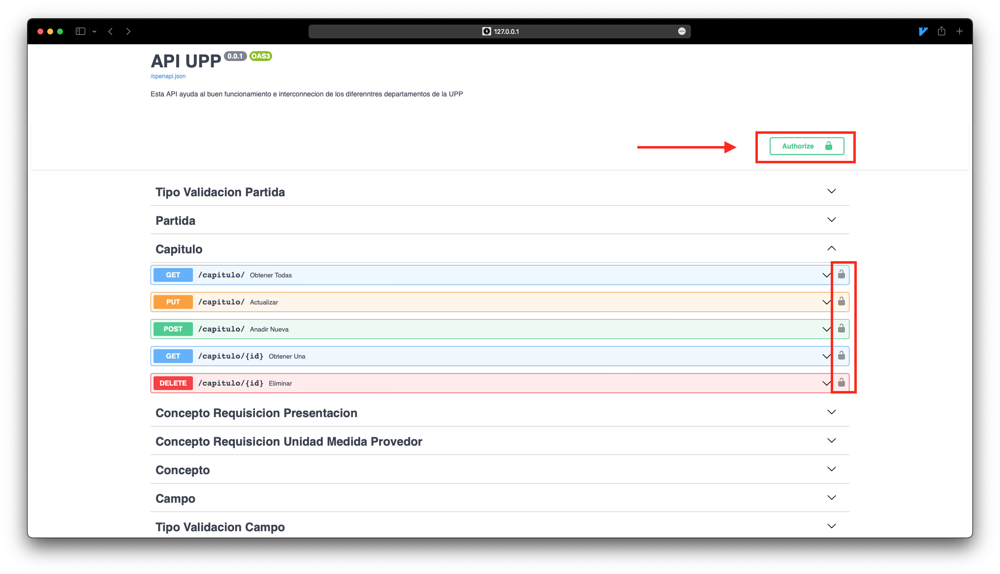
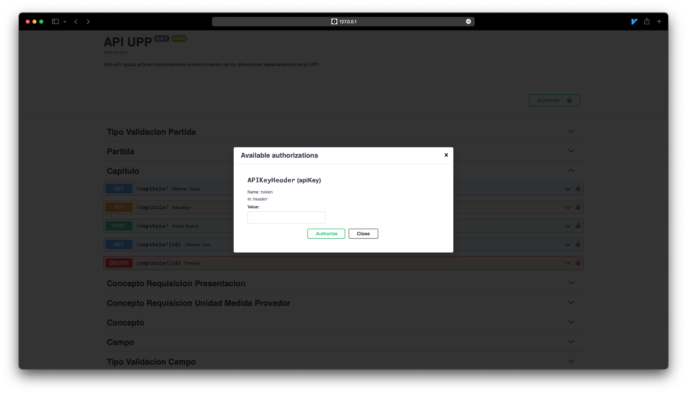
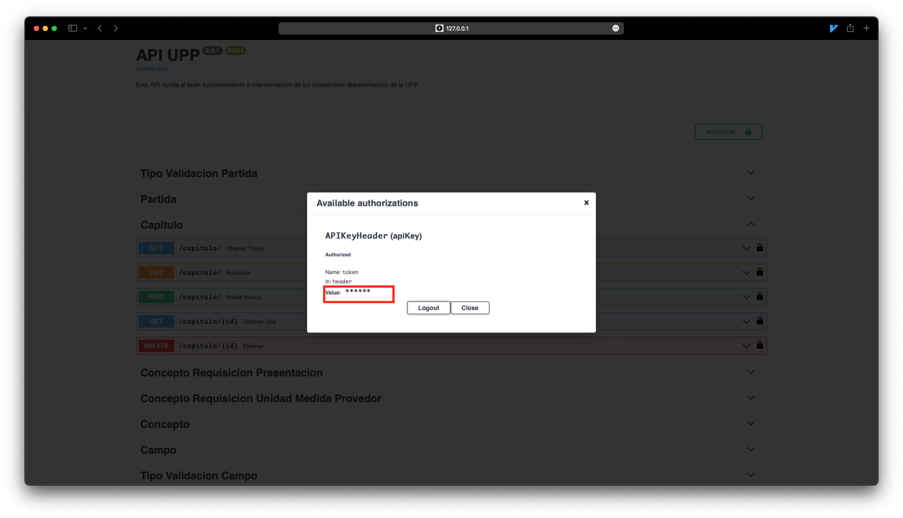
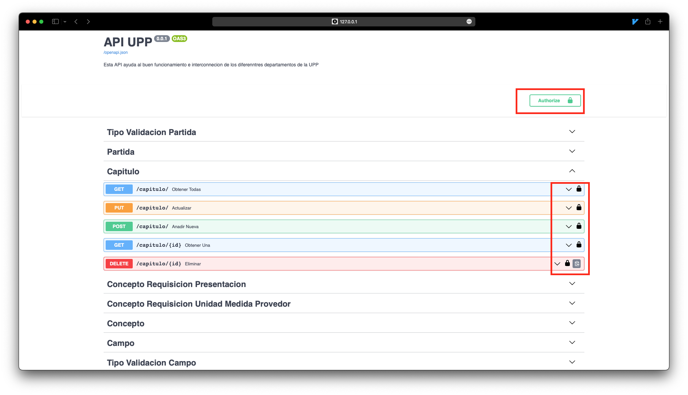

# API Key

¿Para qué proteger nuestras ***rutas***?


Antes de empezar a ver el **router** de nuestra aplicación es necesario que conozcas acerca de la protección de las mismas que se da en conjunto con un **_API KEY _**esto lo hacemos con la intención de que **NO** todo tipo de usuario tenga acceso a todas las rutas dentro de nuestra **_API_** y que no hagan mal uso de la información aquí presentada, para ello veremos los tipos de usuarios que tenemos.

## Tipos de Usuario

:::info
Los emails de los usuarios estarán registrados bajo el dominio de la UPP para poder tener acceso.
:::

###  SuperAdmin
:::caution
Recomiendo que nos hagan muchos registros de super admins, para un mayor control. 
:::
Este tipo de usuario tiene acceso a todo, ya que será el encargado de administrar, toda las tablas catálogos de este departamento


### Moder 

Este serán los usuarios del departamento de compras, por lo que tienen un acceso un poco menor a el superadmin, estos solo se encargaran de revisar, administrar y enviar las requisiciones de los clientes.


### Client 

Estos son los usuarios registrados como clientes, son los que tienen el acceso más bajo y que solo se encargan de visualizar sus peticiones, en dado caso de que así lo desean, también dentro de este tipo de usuario recaen los proveedores, los cuales son los que pueden vender productos a la Universidad.


## ¿Cómo generar un API KEY?

Una vez agregado nuestro usuario con su respectivo **rol **en la ruta `POST` de usuarios, podremos conseguir nuestro token en `usuario/login` (`POST`) en caso de una respuesta de éxito por parte de esta ruta obtendremos una salida como la siguiente:


```json
{
  "idRol": 0,
  "token": "token access"
}
```


Y de aquí podremos obtener nuestro token de acceso para su posterior uso.


## ¿Cómo usar el API KEY?

Una vez generado nuestro **_API KEY_** hay dos formas de usarlo, la cual es ya directamente en algún cliente de nuestra **_API_**, para ello consulta sus sección en el **_Frontend_**.

Pero en esta parte la docs de **_FastAPI _** nos genera un formulario para añadir nuestra API KEY y se pueda usarse de manera automática en las rutas protegidas por esta **_API KEY. _**Como vemos en la siguiente imagen: 






:::info
Una vez agregado nuestra **_API KEY _** veremos el candado cerrado esto quiere decir que la API KEY se agregó de manera correcta y estará lista para enviarse en las rutas en las que sea necesaria.

:::
Ya agregada la API KEY esta se usará en las rutas necesarias y devolverá o no  una respuesta dependiendo del nivel de acceso del token de usuario generado.
