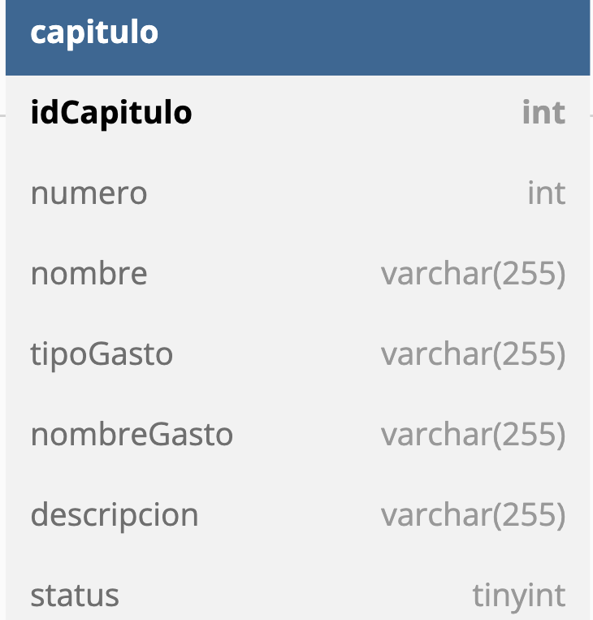

# Schemas
*** Schemas *** y su relación con la base de datos

Los schemas son una parte muy importante del proyecto ya que en ellos se crean las estructuras de las tablas de la base de datos, estas siguen la siguiente estructura.

## Código

```python
from sqlalchemy import Table, Column
from sqlalchemy.sql.sqltypes import Integer, String
from sqlalchemy.dialects.mysql import TINYINT
from src.config.database import meta, engine

chapter = Table(
    "capitulo",
    meta,
    Column('idCapitulo', Integer, primary_key=True),
    Column('numero', Integer, nullable=False),
    Column('nombre', String(255), nullable=False),
    Column('tipoGasto', String(255), nullable=False),
    Column('nombreGasto', String(255), nullable=False),
    Column('descripcion', String(255), nullable=False),
    Column('status', TINYINT, nullable=False),
)

meta.create_all(engine)
```

## Importaciones
Lo primero que tenemos son todas las importacione necesarias del archivo.

## Creación
A Partir de la clase tabla se genera una variable, primero y como string se pasa el nombre de la base de datos y después en esta clase se definen las columnas de las tablas así como los atributos de las mismas,también se le pasa el meta que es la información de la base de datos a la cual nos estamos conectando.


Por último tenemos el engine create all que nos genera toda la sentencia SQL para crear la tabla anteriormente descrita y lo ejecuta teniendo como resultado la siguiente tabla en nuestra base de datos:

## Tabla


